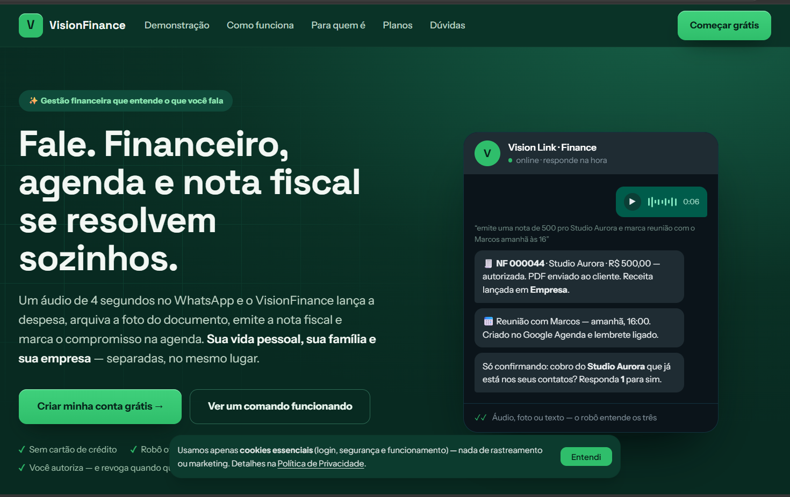
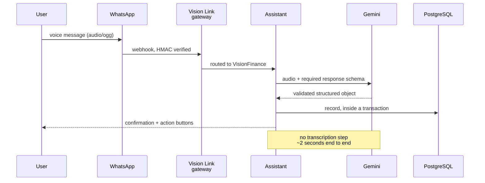
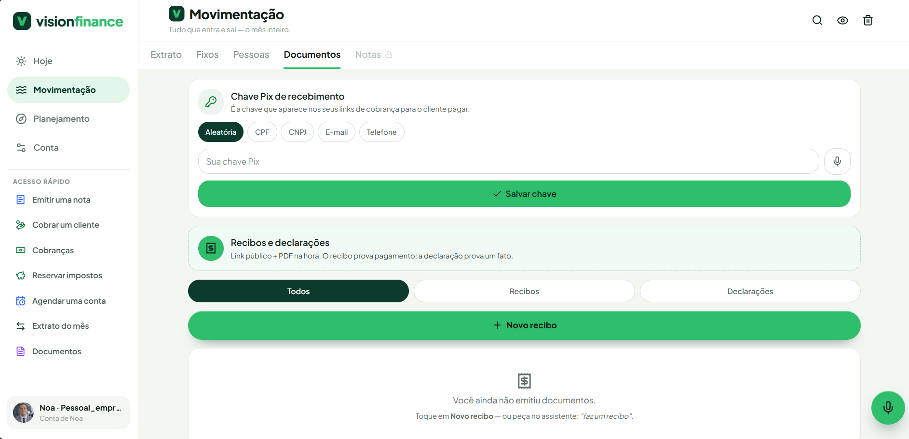

# VisionFinance

Financial management that lives inside WhatsApp. You send a voice message — *"paid the
supplier, four hundred and twenty, split in three"* — and about two seconds later it is a
structured record, with the instalments already scheduled.

> **This is a case study, not the source.** The product is commercial and its repository is
> private. What follows is the architecture and the engineering decisions. Currently in
> testing with individuals and companies, at
> **[finance.visionlink.com.br](https://finance.visionlink.com.br)**.

| | |
|---|---|
| Voice message to structured record | **~2s** |
| Intermediate transcription step | **none** |
| Interface the user has to learn | **WhatsApp** |

From that one record, the assistant produces a **receipt**, a **declaration**, a **scheduled
appointment**, an **instalment charge with a public payment link**, or an **invoice**. The
audio is the only input the user has to give.

---

## The problem

Financial apps lose to the notebook for one reason: the moment you spend money is never the
moment you want to open an app, find the category and type. Every app answers this with a
faster form. The form is the problem.

So the product has no app to open. The interface is the conversation the user is already
having on the phone they already have unlocked.

## The decision that shaped everything

The obvious pipeline is audio → transcription → text parsing → record. Three steps, three
failure modes, and the transcription throws away exactly what matters: hesitation,
correction, the *"no wait, three hundred"* in the middle of the sentence.

The audio goes **straight to the model** with a required response schema. One step. The
model returns a validated object, not prose to be parsed.

## Decisions worth defending

**The schema is required, not suggested.** The model is given a response schema it must
satisfy. What comes back is validated before it reaches the database — a model that
hallucinates a field produces a rejected response, not a corrupt record.

**Reasoning tokens are switched off for this call.** Extended thinking competes with the
output budget and truncates the JSON mid-object. Turning it off, plus a repair pass on
malformed JSON, is the difference between a feature that works and one that fails on the
long sentences — which are the ones that matter.

**Every write is idempotent.** WhatsApp retries webhooks. A retried delivery must not
create a second expense. Idempotency is keyed per event, in the database, in the same
transaction as the write.

**Manual entry is never rate-limited.** The AI assistant consumes a monthly quota; typing
the entry by hand does not. When the quota runs out the product degrades to a normal
financial app instead of locking the user out of their own data.

**Personal data is encrypted, consent is recorded.** Opt-in and opt-out are stored with
timestamps, under Brazilian data protection law. A user who opts out stops receiving
messages across every product on the gateway, not just this one.

## What it does today

Recurring entries, instalment billing with a public payment link, receipts, declarations
and calendar scheduling — all reachable by voice or text. A public page per business
(`/p/{slug}`) and file storage on private S3 with signed URLs.

**Invoice issuing works, and it works by voice.** Each company uploads its own A1 digital
certificate and company data, and issues from then on: the NFS-e comes back authorized, with
the XML. Multi-tenant, self-service, in pre-launch.

That closes the loop the product promises — the audio becomes a record, the record becomes a
charge, and the charge becomes an invoice, without the user leaving WhatsApp.

## Stack

`TypeScript` `React` `Node.js` `PostgreSQL` `Prisma` `Google Gemini` `WhatsApp Cloud API`
`AWS S3` `PWA`

---

<b>Português</b>

 

Gestão financeira que vive dentro do WhatsApp. Você manda um áudio — *"paguei o fornecedor,
quatrocentos e vinte, dividido em três"* — e cerca de dois segundos depois aquilo é um
registro estruturado, com as parcelas já agendadas.

> **Isto é um estudo de caso, não o código.** O produto é comercial e o repositório dele é
> privado. Em teste com pessoas e empresas, em
> **[finance.visionlink.com.br](https://finance.visionlink.com.br)**.

Daquele único registro, o assistente produz **recibo**, **declaração**, **agendamento**,
**cobrança parcelada com link público de pagamento**, ou **nota fiscal**. O áudio é a única
entrada que a pessoa precisa dar.

#### O problema

App de finanças perde para o caderno por um motivo: a hora em que você gasta nunca é a hora
em que você quer abrir um app, achar a categoria e digitar. Todo app responde isso com um
formulário mais rápido. O formulário é o problema.

Então o produto não tem app para abrir. A interface é a conversa que a pessoa já está
tendo, no celular que já está desbloqueado.

#### A decisão que definiu o resto

O caminho óbvio é áudio → transcrição → interpretação do texto → registro. Três etapas, três
modos de falha, e a transcrição joga fora justamente o que importa: a hesitação, a correção,
o *"não, espera, trezentos"* no meio da frase.

O áudio vai **direto ao modelo**, com esquema de resposta obrigatório. Uma etapa. O modelo
devolve um objeto validado, não texto para ser interpretado.

#### Decisões que eu defendo

**O esquema é obrigatório, não sugerido.** O modelo recebe um esquema que precisa cumprir.
O que volta é validado antes de chegar ao banco — modelo que alucina um campo gera resposta
rejeitada, não registro corrompido.

**Raciocínio estendido desligado nessa chamada.** O thinking compete com o orçamento de
saída e trunca o JSON no meio do objeto. Desligar, mais um passo de reparo de JSON
malformado, é a diferença entre a funcionalidade funcionar e falhar nas frases longas — que
são justamente as que importam.

**Toda escrita é idempotente.** O WhatsApp reenvia webhook. Reentrega não pode virar segunda
despesa. A idempotência é por evento, no banco, na mesma transação da escrita.

**Lançamento manual nunca tem cota.** O assistente de IA consome cota mensal; digitar na mão
não. Quando a cota acaba, o produto degrada para um app financeiro normal em vez de trancar
a pessoa fora dos próprios dados.

**Dado pessoal cifrado, consentimento registrado.** Opt-in e opt-out gravados com data,
dentro da LGPD. Quem sai para de receber mensagem de todos os produtos do gateway, não só
deste.

#### O que faz hoje

Lançamento recorrente, cobrança parcelada com link público de pagamento, recibo, declaração
e agendamento — tudo por voz ou texto. Página pública por negócio (`/p/{slug}`) e
armazenamento em S3 privado com URL assinada.

**A nota fiscal sai, e sai por voz.** Cada empresa sobe o próprio certificado digital A1 e os
dados dela, e a partir daí emite: a NFS-e volta autorizada, com o XML. Multi-tenant,
self-service, em pré-lançamento.

Isso fecha o ciclo que o produto promete — o áudio vira lançamento, o lançamento vira
cobrança, e a cobrança vira nota, sem a pessoa sair do WhatsApp.

